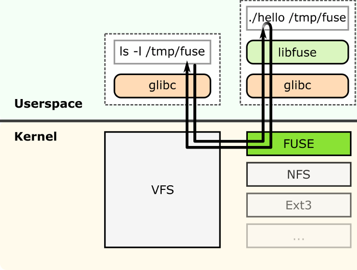
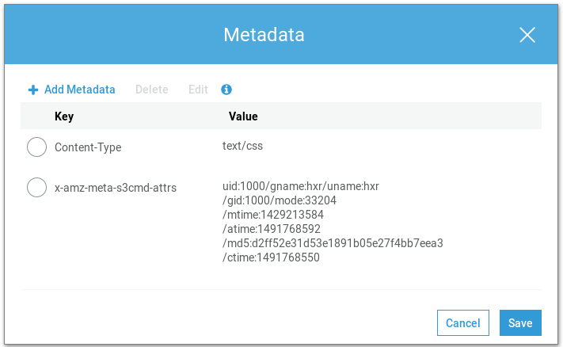
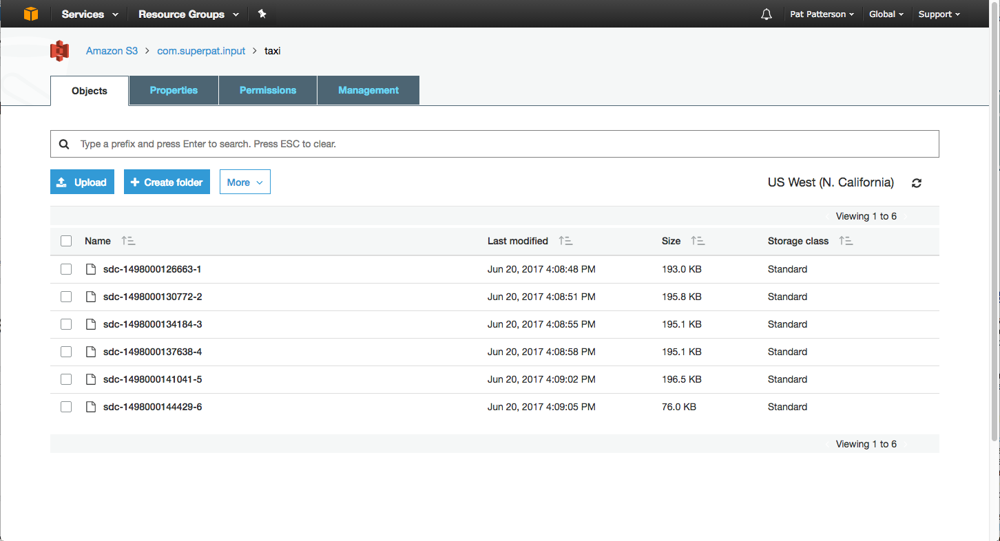
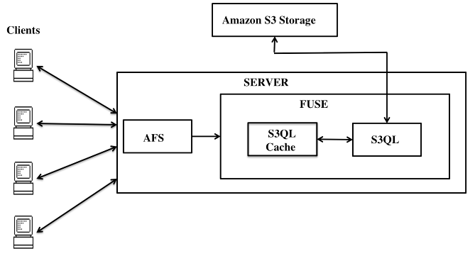

# About Me

- UseGalaxy.eu system administrator
	- Galaxy: Bioinformatics workflow platform
	- EU Server:
		- 3.6k users
		- ~700 active/month
		- \>100k jobs/month
		- 830 TB data
- Exploring S3 FUSE (+ other FUSE systems) in production

# FUSE

"Filesystem in Userspace"



<aside class="notes">
- Write a piece of software that uses FUSE, the kernel will talk to it for handling syscalls related to that filesystem.
</aside>

# FUSE Examples

Project      | Purpose
------------ | -----------------------------------
EncFS        | encrypted filesystem
GlusterFS    | clustered / distributed filesystem
SSHFS        | mount remote filesystems with ssh
WikipediaFS  | edit wikipedia articles
GalaxyFS     | access Galaxy datasets via filesystem


<aside class="notes">
- Any resource available, HTTP, etc, can be exposed as a filesystem.
- If you can think of a way to map a resource, you can write a FUSE filesystem.
</aside>

# Implementing a FUSE Filesystem

```python
    def create(self, path, mode, fi=None):
    def read(self, path, length, offset, fh):
    def open(self, path, flags):
    def write(self, path, buf, offset, fh):
    def chmod(self, path, mode):
    def chown(self, path, uid, gid):
    def getattr(self, path, fh=None):
    def readlink(self, path):
    def rmdir(self, path):
    def mkdir(self, path, mode):
    def unlink(self, path):
    def symlink(self, name, target):
```

<aside class="notes">
- Implement some python and turn it into a filesystem.
</aside>


# S3

- "Simple Storage Service"
- Accessed via HTTP REST API
- (Intentionally) Unreliable


<aside class="notes">
- Intentionally meaning you make tradeoffs
- For an "infinitely" scalable storage service, you trade read-after-write consistency for eventual consistency
</aside>

# Object Storage

- Allows storage of "objects"
- Objects consist of data + metadata



<aside class="notes">
- No specification for metadata
- Here is an example from using the s3cmd tool to upload data
</aside>

# Buckets

- Objects are stored in "buckets"
- Buckets are just a namespace for objects
- Objects are stored under developer provided key



# Tradeoffs

- Eventual Consistency
- Networked storage
	- Availability
	- Must retry failed connections
- Other:
	- Data locality
	- GDPR/Privacy/Regulations
	- Pricing (upload/download expectations)

<aside class="notes">
- Numerous downsides
</aside>

# S3 FUSE

- Access S3 as if it were a local filesystem
- Implementations vary:
	- most try to mirror local vs remote filesystems, identical hierarchies
	- some chunk + upload unique blocks of data

. . .

**Not always a good idea**

<aside class="notes">
- implementation matters
- every access can incur charges
- huge folders is a significant issue with s3fuse, not so with gooyfs.
</aside>

# Implementations

Numerous implementations, all make tradeoffs

Project                                            | Tradeoffs
----------                                         | -----------------------------------------------------------
[`s3fuse`](https://github.com/s3fs-fuse/s3fs-fuse) | Basic support, but does not handle atomic directory renames, `open_excl`, or appending to files.
[`gooyfs`](https://github.com/kahing/goofys)       | Main focus is speed, sacrifices all but basic operations
[`riofs`](https://github.com/skoobe/riofs)         | Similar to s3fuse
[`s3ql`](https://github.com/s3ql/s3ql)             | Most complete POSIX support, but s3 hierarchy is *opaque*

and [many more...](https://github.com/s3ql/s3ql/wiki)

# S3-FUSE

- Broad use case: "s3 as a filesystem"
- Attempts 1:1 mapping
- Must manually enable caching for performant behaviour

<aside class="notes">
- once caching enabled, works ok.
</aside>

. . .

```
[INF]       curl.cpp:HeadRequest(2516): [tpath=/a]
[INF]       curl.cpp:PreHeadRequest(2453): [tpath=/a][bpath=][save=][sseckeypos=-1]
[INF]       curl.cpp:prepare_url(4205): URL is https://s3.amazonaws.com/test-galaxians-org/a
[INF]       curl.cpp:prepare_url(4237): URL changed is https://test-galaxians-org.s3.amazonaws.com/a
[INF]       curl.cpp:insertV4Headers(2267): computing signature [HEAD] [/a] [] []
[INF]       curl.cpp:url_to_host(100): url is https://s3.amazonaws.com
[INF]       curl.cpp:RequestPerform(1962): HTTP response code 404 was returned, returning ENOENT
[INF]       curl.cpp:HeadRequest(2516): [tpath=/a/]
[INF]       curl.cpp:PreHeadRequest(2453): [tpath=/a/][bpath=][save=][sseckeypos=-1]
[INF]       curl.cpp:prepare_url(4205): URL is https://s3.amazonaws.com/test-galaxians-org/a/
[INF]       curl.cpp:prepare_url(4237): URL changed is https://test-galaxians-org.s3.amazonaws.com/a/
[INF]       curl.cpp:insertV4Headers(2267): computing signature [HEAD] [/a/] [] []
[INF]       curl.cpp:url_to_host(100): url is https://s3.amazonaws.com
[INF]       curl.cpp:RequestPerform(1962): HTTP response code 404 was returned, returning ENOENT
[INF]       curl.cpp:HeadRequest(2516): [tpath=/a_$folder$]
[INF]       curl.cpp:PreHeadRequest(2453): [tpath=/a_$folder$][bpath=][save=][sseckeypos=-1]
[INF]       curl.cpp:prepare_url(4205): URL is https://s3.amazonaws.com/test-galaxians-org/a_%24folder%24
[INF]       curl.cpp:prepare_url(4237): URL changed is https://test-galaxians-org.s3.amazonaws.com/a_%24folder%24
[INF]       curl.cpp:insertV4Headers(2267): computing signature [HEAD] [/a_$folder$] [] []
[INF]       curl.cpp:url_to_host(100): url is https://s3.amazonaws.com
[INF]       curl.cpp:RequestPerform(1962): HTTP response code 404 was returned, returning ENOENT
[INF]   s3fs.cpp:list_bucket(2477): [path=/a]
[INF]       curl.cpp:ListBucketRequest(2960): [tpath=/a]
[INF]       curl.cpp:prepare_url(4205): URL is https://s3.amazonaws.com/test-galaxians-org?delimiter=/&max-keys=2&prefix=a/
[INF]       curl.cpp:prepare_url(4237): URL changed is https://test-galaxians-org.s3.amazonaws.com?delimiter=/&max-keys=2&prefix=a/
[INF]       curl.cpp:insertV4Headers(2267): computing signature [GET] [/] [delimiter=/&max-keys=2&prefix=a/] []
[INF]       curl.cpp:url_to_host(100): url is https://s3.amazonaws.com
[INF]       curl.cpp:RequestPerform(1940): HTTP response code 200
[WAN] s3fs.cpp:append_objects_from_xml_ex(2575): contents_xp->nodesetval is empty.
[WAN] s3fs.cpp:append_objects_from_xml_ex(2575): contents_xp->nodesetval is empty.
[INF]       cache.cpp:AddNoObjectCache(429): add no object cache entry[path=/a]
[INF] s3fs.cpp:s3fs_create(970): [path=/a][mode=100664][flags=33345]
[INF]     s3fs.cpp:create_file_object(931): [path=/a][mode=100664]
[INF]       curl.cpp:PutRequest(2693): [tpath=/a]
[INF]       curl.cpp:PutRequest(2710): create zero byte file object.
[INF]       curl.cpp:prepare_url(4205): URL is https://s3.amazonaws.com/test-galaxians-org/a
[INF]       curl.cpp:prepare_url(4237): URL changed is https://test-galaxians-org.s3.amazonaws.com/a
[INF]       curl.cpp:insertV4Headers(2267): computing signature [PUT] [/a] [] []
[INF]       curl.cpp:url_to_host(100): url is https://s3.amazonaws.com
[INF]       curl.cpp:PutRequest(2804): uploading... [path=/a][fd=-1][size=0]
[INF]       curl.cpp:RequestPerform(1940): HTTP response code 200
[INF]       cache.cpp:DelStat(565): delete stat cache entry[path=/a]
[INF]       curl.cpp:HeadRequest(2516): [tpath=/a]
[INF]       curl.cpp:PreHeadRequest(2453): [tpath=/a][bpath=][save=][sseckeypos=-1]
[INF]       curl.cpp:prepare_url(4205): URL is https://s3.amazonaws.com/test-galaxians-org/a
[INF]       curl.cpp:prepare_url(4237): URL changed is https://test-galaxians-org.s3.amazonaws.com/a
[INF]       curl.cpp:insertV4Headers(2267): computing signature [HEAD] [/a] [] []
[INF]       curl.cpp:url_to_host(100): url is https://s3.amazonaws.com
[INF]       curl.cpp:RequestPerform(1940): HTTP response code 200
[INF]       cache.cpp:AddStat(356): add stat cache entry[path=/a]
[INF] s3fs.cpp:s3fs_getattr(812): [path=/a]
[INF] s3fs.cpp:s3fs_flush(2185): [path=/a][fd=8]
[INF]       fdcache.cpp:RowFlush(1425): [tpath=][path=/a][fd=8]
[INF] s3fs.cpp:s3fs_flush(2185): [path=/a][fd=8]
[INF]       fdcache.cpp:RowFlush(1425): [tpath=][path=/a][fd=8]
[INF]       curl.cpp:PutRequest(2693): [tpath=/a]
[INF]       curl.cpp:prepare_url(4205): URL is https://s3.amazonaws.com/test-galaxians-org/a
[INF]       curl.cpp:prepare_url(4237): URL changed is https://test-galaxians-org.s3.amazonaws.com/a
[INF]       curl.cpp:insertV4Headers(2267): computing signature [PUT] [/a] [] [0e8b03382728f012c44a7b16051f59559ef186fece1a664fce48a59f93caaded]
[INF]       curl.cpp:url_to_host(100): url is https://s3.amazonaws.com
[INF]       curl.cpp:PutRequest(2804): uploading... [path=/a][fd=8][size=225]
[INF]       curl.cpp:RequestPerform(1940): HTTP response code 200
[INF] s3fs.cpp:s3fs_release(2238): [path=/a][fd=8]
[INF]       cache.cpp:DelStat(565): delete stat cache entry[path=/a]
[INF]       fdcache.cpp:GetFdEntity(1986): [path=/a][fd=8]
```

# Gooyfs

- Narrow use case: performance at all costs
- Some restrictions:
	- only sequential writes supported
	- does not store file mode/owner/group
	- does not support symlink or hardlink
	- ctime, atime is always the same as mtime
	- cannot rename non-empty directories
	- unlink returns success even if file is not present
	- fsync is ignored, files are only flushed on close
- If caching is needed, requires layering FUSE filesystems with [catfs](https://github.com/kahing/catfs)

# S3QL

- Narrow use case: essentially hourly backup of storage
- Interesting implementation:
	- Metadata (path, permissions, etc.) are in local SQLite DB
	- Data is chunked + hashed, unique chunks uploaded
	- De-duplication
	- CoW



# POSIX Compliance

> A file system for the S3 API is a leaky abstraction. Don't expect POSIX file system semantics.
>
> -- Riofs developers

- S3 has use cases, acting as a posix compliant filesystem is *not* one of them.
	- E.g. `open_excl` is difficult
- eventual consistency is not expected by unix applications
- s3ql works around many issues by operating locally and storing a "metadata" journal

<aside class="notes">
- Stop asking for it. seriously.
- most explicitly request "ONLY mount read-write once"
- some say to be prepared to just "re-run your rsync"
</aside>


# S3-FUSE Use Cases

- WORM datasets (Write Once Read Many)
	- Logging data / legal requirements
	- Reference data (e.g. [AWS Genomics](https://aws.amazon.com/health/genomics/), [1000 Genomes Project](https://aws.amazon.com/1000genomes/))
	- Workflow systems
	- Backups
- Whenever stale data is acceptable
	- Image data: user avatars, product pictures
	- Static website hosting

# Logging Use Case

- Legal requirements to not be updated
- FUSE permits use of logrotate

# Reference Data

- Datasets can be made available easily
	- Publicly
	- With restricted permissions
	- (On AWS) at the expense of the requester
- Mounted locally with FUSE and used transparently
- Cache only requested chunks (implementation dependent)
- Similar to CVMFS
	- HTTP API
	- Support for range requests
	- Caching

# Galaxy Use Case

- Jobs:
	- Inputs are read-only, not permitted to modify datasets in place
	- Scratch is node-local storage
	- Outputs can be written to S3 (with read-after-write)
	- Datasets are **never** updated after creation
- Read-only ⇒ Few POSIX features required
- `s3fuse` lets us swap to S3 in place, without modifying the system

<aside class="notes">
- We have found that s3-fuse is a good fit.
- it "looks" and behaves enough like a real filesystem for us:
	- we don't need atomic directory renames
	- we don't need exclusive opens.
	- just open/read/getattr/readdir
</aside>

# Conclusion

> Object storage is another way of saying that globally coherent fast posix file access is hard, so here's some thin layers over a key-value store, you do the rest
>
> -- 2015, KaiserPro

# Conclusion

- S3 is really cool! It has a lot of nice features like:
	- "infinite" scalability
	- programmatic API
	- rich authentication (on AWS)
- But you must consider whether it is a good fit
- Even with S3-FUSE, it is **not a general purpose filesystem**


<style type="text/css">
.reveal { font-size: 30px; }
.reveal section img { border: none; padding: 0.5em; }
.img-50 { width: 50%; }
</style>
